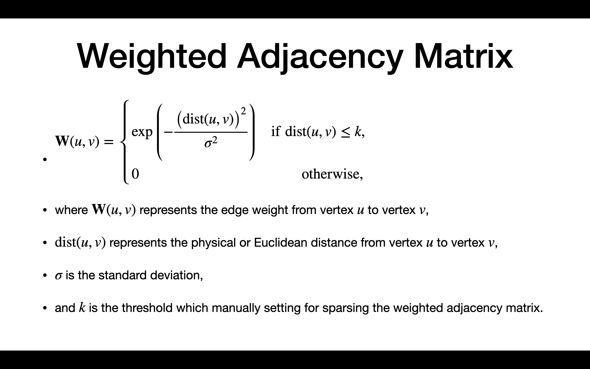
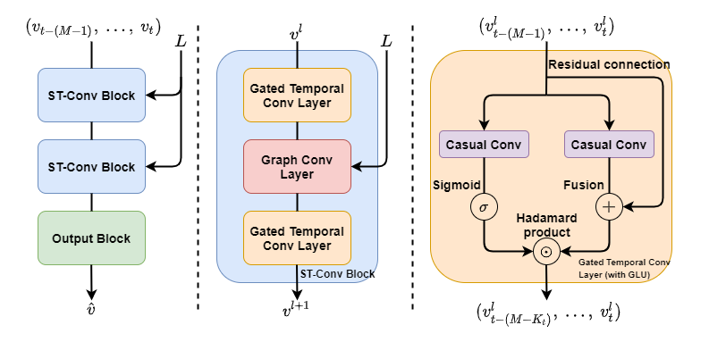

# Spatio-Temporal Graph Convolutional Networks
[](https://github.com/hazdzz/STGCN/issues)
[](https://github.com/hazdzz/STGCN/network/members)
[](https://github.com/hazdzz/STGCN/stargazers)
[](./LICENSE)

## About
This is a slight modification of Chieh Cheng's PyTorch implementation of STGCN, found here: https://github.com/hazdzz/STGCN. Modifications including adaption of the data loading system for our file structure, inclusion of a simple Jupyter wrapper for Colab instances, and the below instructions for running. Original README contents included below for posterity.

The PyTorch version of STGCN implemented for the paper *Spatio-Temporal Graph Convolutional Networks:
A Deep Learning Framework for Traffic Forecasting*.

## How to Run
This implementation supports 2 ways of running; via the main.py file or the STGCN.ipynb file.

To run using main.py:
1. First ensure that all requirements are met by running `pip install -r ./requirements.txt` from the root STGCN directory.
2. From the directory main.py is in, run `python main.py` from the command line.
2.1. Optional Parameters:
	-  -\-enable_cuda (default True): Whether CUDA should be enabled for this runtime
	- -\-seed (default 42): Seed for RNG, for stabilizing results
	- -\-dataset (default 'metr-la'). Options for dataset to run on. Can be 'metr-la' or 'pemsd7-m'
	- -\-n_his (default 12): Historical window size
	- -\-n_pred (default 3): Predictive window size
	- -\-time_intvl (default 5): Polling window between time steps in data set
	- -\-Kt (default 3):
	- -\-stblock_num (default 2)
	- -\-act_func (default 'glu'): Activation functions for Temporal Convolution Module. Can be 'glu' or 'gtu'
	- -\-Ks (default 3)
	- -\-graph_conv_type (default 'cheb_graph_conv'): Approximation algorithm for graph convolution. Can be 'cheb_graph_conv' or 'graph_conv'
	- -\-gso_type (default 'sym_norm_lap')
	- -\-enable_bias (default True): Enable bias in model. Can be True or False.
	- -\-droprate (default 0.5): Drop rate of convolutional layers
	- -\-lr (default 1e-3): Learning rate
	- -\-weight_decay-rate (default 5e-4): L2 penalty for weight decay
	- -\-batch_size (default 32): Batch size for training
	- -\-epochs (default 10000): Number of training epochs. Note that due to support for early termination the model is unlikely to need to train for the full amount of epochs
	- -\-opt (default 'adam'): Optimizer. See PyTorch documentation for list of optimizations
	- -\-step_size (default 10): Training step size
	- -\-gamma (default 95): Gamma value for network training
	- -\-patience (default 30): Number of epochs to wait with no change in performance for early stopping

To run using STGCN.ipynb:
1. Open the Jupyter file, either locally or via Colab. If using Colab, ensure that rest of files are uploaded to your drive. Modify first box as needed to access correct folder.
2. Modify parameters of training boxes as necessary. See above for full list of parameters.

## Paper
https://arxiv.org/abs/1709.04875

## Related works
1. TCN: [*An Empirical Evaluation of Generic Convolutional and Recurrent Networks for Sequence Modeling*](https://arxiv.org/abs/1803.01271)
2. GLU and GTU: [*Language Modeling with Gated Convolutional Networks*](https://arxiv.org/abs/1612.08083)
3. ChebNet: [*Convolutional Neural Networks on Graphs with Fast Localized Spectral Filtering*](https://arxiv.org/abs/1606.09375)
4. GCN: [*Semi-Supervised Classification with Graph Convolutional Networks*](https://arxiv.org/abs/1609.02907)

## Related code
1. TCN: https://github.com/locuslab/TCN
2. ChebNet: https://github.com/mdeff/cnn_graph
3. GCN: https://github.com/tkipf/pygcn

## Dataset
### Source
1. METR-LA: [DCRNN author's Google Drive](https://drive.google.com/file/d/1pAGRfzMx6K9WWsfDcD1NMbIif0T0saFC/view?usp=sharing)
2. PEMS-BAY: [DCRNN author's Google Drive](https://drive.google.com/file/d/1wD-mHlqAb2mtHOe_68fZvDh1LpDegMMq/view?usp=sharing)
3. PeMSD7(M): [STGCN author's GitHub repository](https://github.com/VeritasYin/STGCN_IJCAI-18/blob/master/data_loader/PeMS-M.zip)

### Preprocessing
Using the formula from [ChebNet](https://arxiv.org/abs/1606.09375)：


## Model structure


## Differents of code between mine and author's
1. Fix bugs 
2. Add Early Stopping approach
3. Add Dropout approach
4. Offer a different set of hyperparameters
5. Offer config files for two different categories graph convolution (ChebyGraphConv and GraphConv)
6. Add datasets METR-LA and PEMS-BAY
7. Adopt a different data preprocessing method

## Requirements
To install requirements:
```console
pip3 install -r requirements.txt
```